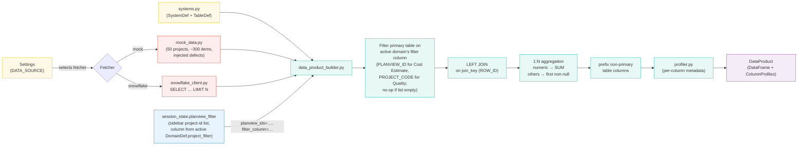
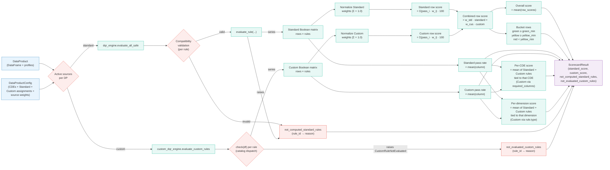
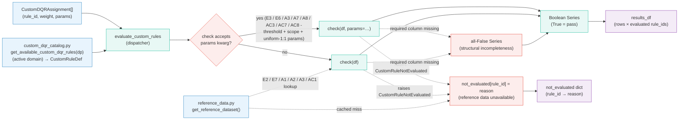
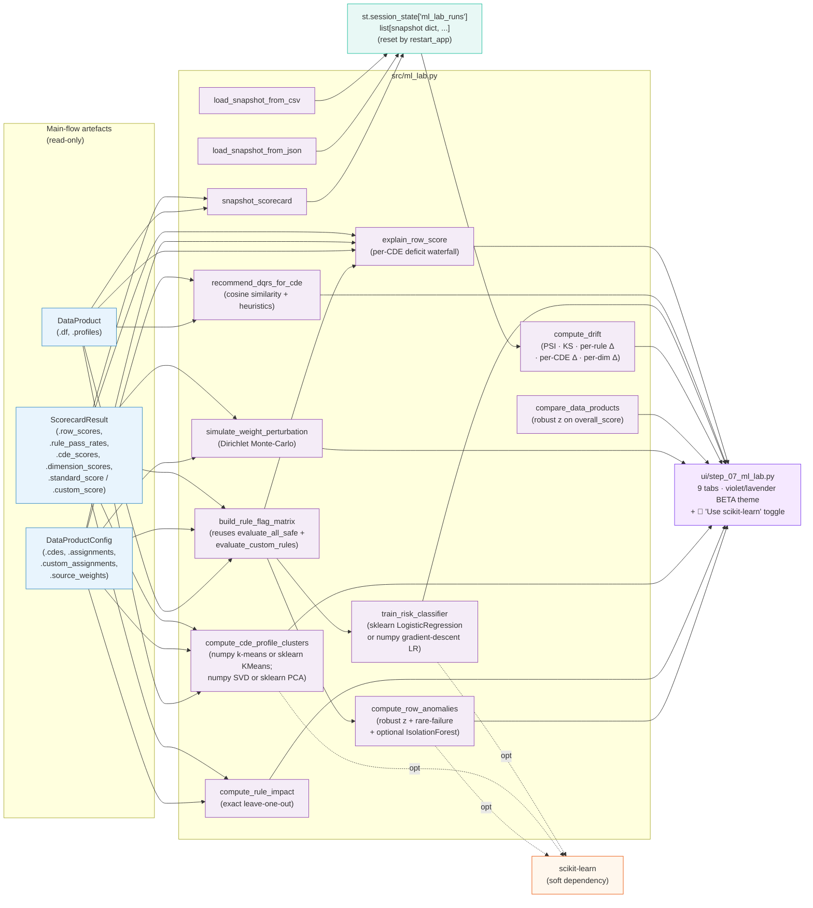

# Data Quality Scorecard App - Block Diagram

This block diagram shows the application's components, their groupings, and dependencies. Each block is a module or layer; arrows show "calls" or "depends on" relationships.

> Rendered with Mermaid. View on GitHub or any Mermaid-aware viewer.

---

## High-Level Block Diagram

```mermaid
flowchart LR
    %% ==================== PRESENTATION LAYER ====================
    subgraph Presentation["Presentation Layer (Streamlit)"]
        APP["app.py<br/>(entry point + step dispatcher<br/>+ consume_scroll_to_top)"]
        subgraph UI["ui/  -  Mode picker → (⚡ One-click | 🛠️ Step-by-step: Step 0 + 6 steps) + 🧪 ML Lab beta<br/>(every step's nav row: Back · Restart · Next)"]
            SM["Entry<br/>Mode Selection<br/>(⚡ One-click / 🛠️ Step-by-step)"]
            OC["⚡ One-click<br/>Domain + Systems → Generate<br/>(→ run_one_click → dashboard)"]
            S0["Step 0<br/>Domain Selection (Step-by-step)<br/>(Cost Estimate / Quality / ...)"]
            S1["Step 1<br/>System Selection<br/>(active domain's systems)"]
            S2["Step 2<br/>Data Product Review<br/>(prefetches reference datasets)"]
            S3["Step 3<br/>CDE Selection<br/>(data_editor grid + hover badges<br/>+ 🎯 Custom DQR cues<br/>+ Select-all-required shortcut)"]
            S4["Step 4<br/>DQR Source Selection<br/>(Standard / Custom / both<br/>+ source-level weights)"]
            S4_1["Step 4.1<br/>Standard DQR Assignment<br/>(per-CDE dimensions +<br/>compatibility validation<br/>+ Apply-all-suggested shortcut)"]
            S4_2["Step 4.2<br/>Custom DQR Cards<br/>(rule cards + per-rule toggles<br/>+ threshold selectboxes (P-pct / IQR k)<br/>+ CDE-coverage validation<br/>+ Select-all-rules shortcut)"]
            S5["Step 5<br/>Weight Assignment<br/>(blank inputs + Distribute equally,<br/>per active source)"]
            S6["Step 6<br/>Dashboard<br/>(orchestrator + ui/step_06/_*:<br/>_shared · _export · _charts ·<br/>_breakdown · _drilldown ·<br/>_history · _dp_dashboard)"]
            S7["🧪 Step 7 - ML Lab (beta)<br/>orchestrator + ui/step_07/_*:<br/>_shared · _row_anomalies · _rule_impact ·<br/>_cde_clusters · _weight_sensitivity ·<br/>_cross_dp · _run_history · _risk_model ·<br/>_recommendations · _row_explain"]
        end
        subgraph UTILS["utils/"]
            SS["session_state.py (re-export shim)<br/>→ utils/session/state.py · navigation.py ·<br/>sidebar.py"]
            UIC["ui_components.py<br/>(render_nav_footer · shared by<br/>Steps 02-05 + 04.2)"]
            HLP["helpers.py<br/>(colors, weights, format)"]
        end
    end

    %% ==================== DOMAIN / CORE LAYER ====================
    subgraph Domain["Domain & Core Logic (src/)"]
        MOD["models.py<br/>(dataclasses,<br/>incl. CustomDQRAssignment)"]
        PROF["profiler.py"]
        ENG["dqr_engine.py<br/>(10 rule fns +<br/>evaluate_all_safe)"]
        VAL["dqr_validation.py<br/>(compatibility layer)"]
        CENG["custom_dqr_engine.py (re-export shim)<br/>→ src/custom_dqr/_shared · _validators ·<br/>_ept_rules (E1-E7) · _adr_rules (A1-A8) ·<br/>_acce_rules (AC1-AC8) · _sqs_rules (SQ4-SQ10) ·<br/>_dispatcher + per-rule TypedDicts for params"]
        REF["reference_data.py<br/>(prefetch · cache ·<br/>VWS_GP_STANDARD_SHARE)"]
        DPB["data_product_builder.py"]
        SCR["scorecard.py<br/>(per-source scores +<br/>source-weighted combine)"]
        OCS["one_click.py<br/>(run_one_click ·<br/>build_one_click_config ·<br/>default_rule_params;<br/>custom-only · required CDEs ·<br/>equal weights; UI-free)"]
        MLL["ml_lab.py<br/>(unsupervised analytics + drift +<br/>supervised risk + DQR reco +<br/>row explainability; numpy fallbacks<br/>+ optional sklearn swap-ins)"]
    end

    %% ==================== OPTIONAL SOFT DEPENDENCY ====================
    SKL["scikit-learn (optional)<br/>IsolationForest · KMeans · PCA ·<br/>LogisticRegression"]

    %% ==================== CONFIG LAYER ====================
    subgraph Config["Configuration (config/)"]
        SET["settings.py<br/>(.env loader — local only;<br/>defaults inside SiS)"]
        DOM["domains.py<br/>(DomainDef registry:<br/>Cost Estimate + Quality + ...)"]
        SYS["systems.py<br/>(SystemDef / TableDef +<br/>ADR/ACCE/EPT Cost Estimate)"]
        CAT["dqr_catalog.py<br/>(10 dimensions)"]
        SRC["dqr_sources.py<br/>(SOURCE_STANDARD,<br/>SOURCE_CUSTOM)"]
        CCAT["custom_dqr_catalog.py (re-export shim)<br/>→ config/custom_dqr/_shared (CustomRuleDef +<br/>option-builder helpers) ·<br/>_ept_catalog · _adr_catalog · _acce_catalog ·<br/>_sqs_catalog + get_available_custom_dqr_rules<br/>(resolves through active domain)"]
    end

    %% ==================== DATA LAYER ====================
    subgraph Data["Data Sources"]
        MOCK["mock_data.py<br/>(synthetic generator)"]
        SF["snowflake_client.py<br/>(Snowpark session in SiS /<br/>externalbrowser connector locally)"]
        SFDB[("Snowflake DW")]
    end

    %% ==================== EXPORTS ====================
    subgraph Out["Outputs"]
        CSV["CSV<br/>rows + row score + status +<br/>per-rule score columns<br/>(Standard + Custom, weight in header) +<br/>reference-dataset columns<br/>(suffixed with origin dataset)"]
        JSON["JSON<br/>config + summary"]
    end

    %% ---- Wiring: app dispatches to steps
    APP --> SM & OC & S0 & S1 & S2 & S3 & S4 & S4_1 & S4_2 & S5 & S6 & S7
    APP --> SS

    %% ---- UI uses utils
    SM & OC & S0 & S1 & S2 & S3 & S4 & S4_1 & S4_2 & S5 & S6 & S7 --> SS
    S0 --> DOM

    %% ---- One-click step → automation service → reuses the Step-by-step builders
    OC --> OCS
    OC --> DOM
    OC --> S6
    OCS --> DPB
    OCS --> PROF
    OCS --> REF
    OCS --> SCR
    OCS --> CCAT
    S5 --> HLP
    S6 --> HLP
    S7 --> HLP

    %% ---- ML Lab uses the core analytics module + reads main-flow artefacts
    S7 --> MLL
    S7 --> SCR
    MLL --> ENG
    MLL --> CENG
    MLL --> MOD
    MLL -.optional swap-in.-> SKL

    %% ---- UI uses domain & config
    S1 --> SYS
    S2 --> DPB
    S2 --> PROF
    S2 --> REF
    S3 --> MOD
    S3 --> CCAT
    S4 --> SRC
    S4_1 --> CAT
    S4_1 --> ENG
    S4_1 --> VAL
    S4_2 --> CCAT
    S5 --> MOD
    S6 --> SCR

    %% ---- Domain internals
    SCR --> ENG
    SCR --> CENG
    SCR --> SRC
    ENG --> VAL
    VAL --> CAT
    VAL --> MOD
    ENG --> MOD
    CENG --> MOD
    CENG --> REF
    CCAT --> CENG
    CCAT --> DOM
    SYS --> DOM
    DOM --> SYS
    DPB --> PROF
    DPB --> MOD
    DPB --> SYS
    PROF --> MOD
    ENG --> CAT

    %% ---- Domain reaches data
    DPB --> MOCK
    DPB --> SF
    REF --> MOCK
    REF --> SF
    SF --> SFDB

    %% ---- Settings is loaded by everyone that needs env
    SET --> APP
    SET --> DPB
    SET --> SF
    SET --> SS
    SET --> SCR

    %% ---- Step 6 outputs
    S6 --> CSV
    S6 --> JSON

    classDef presentation fill:#E8F4FD,stroke:#2E86C1,color:#1B4F72
    classDef domain fill:#E8F8F5,stroke:#1ABC9C,color:#0E6655
    classDef config fill:#FEF9E7,stroke:#F1C40F,color:#7D6608
    classDef data fill:#FDEDEC,stroke:#E74C3C,color:#7B241C
    classDef output fill:#F4ECF7,stroke:#8E44AD,color:#4A235A
    classDef beta fill:#F5E8FF,stroke:#7C3AED,color:#4C1D95
    classDef softdep fill:#FFF7ED,stroke:#EA580C,color:#7C2D12

    class APP,SM,OC,S0,S1,S2,S3,S4,S4_1,S4_2,S5,S6,SS,HLP,UIC presentation
    class S7,MLL beta
    class MOD,PROF,ENG,VAL,CENG,REF,DPB,SCR,OCS domain
    class SET,SYS,CAT,SRC,CCAT config
    class MOCK,SF,SFDB data
    class CSV,JSON output
    class SKL softdep
```

---

## Layer Responsibilities

| Layer | Modules | Responsibility |
|-------|---------|----------------|
| **Presentation** | [app.py](../app.py), [ui/](../ui/), [utils/](../utils/) | Render the Streamlit workflow: the entry **mode picker** ([step_mode_selection.py](../ui/step_mode_selection.py)) routing to **⚡ One-click** ([step_one_click.py](../ui/step_one_click.py)) or the **🛠️ Step-by-step** steps (Step 0 domain picker + Steps 1-6 + sub-steps 4.1/4.2 + Step 7 ML Lab); manage session state and `app_mode`-aware navigation |
| **Domain / Core** | [src/](../src/) | Pure Python logic for profiling, Standard + Custom rule evaluation, reference-data prefetch, joining, scoring, and the **One-click automation service** ([one_click.py](../src/one_click.py)), no Streamlit imports |
| **Configuration** | [config/](../config/) | Static system catalog, Standard DQ-dimension catalog, Custom DQR per-DP catalog (partitioned by system in [config/custom_dqr/](../config/custom_dqr/)), source identifiers, environment-driven settings, domain registry |
| **Data** | [src/mock_data.py](../src/mock_data.py), [src/snowflake_client.py](../src/snowflake_client.py) | Pluggable data fetchers (system tables + reference datasets); selected at runtime by `Settings.data_source` |
| **Output** | [ui/step_06_dashboard.py](../ui/step_06_dashboard.py) | CSV (rows + row score + status + one column per Standard / Custom rule carrying the row's per-rule score, weight embedded in the column header + the reference-dataset columns for every referential-integrity Custom rule, left-joined onto the rows and suffixed with the origin dataset) and JSON (config + scorecard summary) downloads. The same per-rule score and reference columns drive the "Worst rows" Step 6 tab and the click-to-drill-down tables (clicking a By-CDE / By-Dimension bar or selecting a Rules / Custom Rules row surfaces the failing rows, worst first, capped at 200). |
| **🧪 ML Lab (beta)** | [src/ml_lab.py](../src/ml_lab.py), [ui/step_07_ml_lab.py](../ui/step_07_ml_lab.py) (orchestrator) + [ui/step_07/](../ui/step_07/) (one module per tab) | Read-only experimental analytics on top of the rules-based scorecard. Re-derives the per-row pass/fail matrix from the same evaluators the dashboard uses, then runs unsupervised + statistical views (anomalies, rule impact, clustering, weight sensitivity, cross-DP) and run-history / supervised views (snapshots, drift, risk model, DQR recommendations, row explainability). See [ML_LAB.md](ML_LAB.md). |

### Internal partitioning of large modules

Several modules in the Domain / Core and Presentation layers grew past a
few hundred lines and were partitioned into per-concern packages. Each
keeps its legacy module name as a slim re-export shim so external
callers don't change:

| Public entry | Internal package | Per-file responsibility |
|---|---|---|
| `src/custom_dqr_engine.py` (re-exports) | [src/custom_dqr/](../src/custom_dqr/) | `_shared.py` (errors + reusable predicates), `_validators.py`, `_ept_rules.py` (E1-E7), `_adr_rules.py` (A1-A8), `_acce_rules.py` (AC1-AC8), `_sqs_rules.py` (SQ4-SQ10), `_dispatcher.py` |
| `config/custom_dqr_catalog.py` (assembles `CUSTOM_DQR_RULES` for Cost Estimate) | [config/custom_dqr/](../config/custom_dqr/) | `_shared.py` (dataclasses + option-builder helpers), `_ept_catalog.py`, `_adr_catalog.py`, `_acce_catalog.py`, `_sqs_catalog.py` (SQ4-SQ10, wired into the Quality domain) |
| `utils/session_state.py` (re-exports) | [utils/session/](../utils/session/) | `state.py` (STEPS + init + domain), `navigation.py` (next / prev / restart + visibility), `sidebar.py` (CSS + brand + filters) |
| `ui/step_07_ml_lab.py` (orchestrator) | [ui/step_07/](../ui/step_07/) | One module per tab (`_row_anomalies.py`, `_rule_impact.py`, ..., `_row_explain.py`) + `_shared.py` (CSS + banner + `_ensure_scorecards`) |

---

## Data Product Build - Sub-Diagram

---

## Scorecard Computation - Sub-Diagram

---

## Custom DQR Evaluation - Sub-Diagram

---

## ML Lab - Sub-Diagram (Step 7, beta)

The ML Lab is a read-only consumer of the same `DataProduct`, `DataProductConfig` and `ScorecardResult` objects the dashboard renders. It owns one extra session-state key - `ml_lab_runs`, which holds the time-series of scorecard snapshots used by the run-history + drift views.

**Read-only contract.** No arrow exits the lab back to `DataProduct`, `DataProductConfig` or `ScorecardResult`. The lab can only mutate its own session-state key (`ml_lab_runs`). `restart_app` wipes it alongside the workflow's own state.

**See [ML_LAB.md](ML_LAB.md)** for per-algorithm formulas, parameters and limitations.

---

## Key Cross-Cutting Concerns

- **Session state** ([utils/session_state.py](../utils/session_state.py)) is the single source of truth for the UI: `app_mode` (the chosen One-click / Step-by-step mode, set at the entry step), `current_step`, `selected_systems`, `data_products`, `configs`, `scorecards`, `sample_mode`, `planview_filter`, plus `one_click_summary` (the dashboard's post-One-click banner) and `ml_lab_runs` (owned by Step 7). Step modules are otherwise stateless.
- **Mode-aware navigation**: `app_mode` drives `_visible_steps()` so the Step-by-step steps and the One-click step never show together. One-click reuses the Step-by-step builders/engines verbatim through [src/one_click.py](../src/one_click.py), so both flows produce identical scorecards from the same config shape.
- **Pluggable data fetcher**: [src/data_product_builder.py](../src/data_product_builder.py) accepts any callable returning a DataFrame. This makes adding new sources (e.g., BigQuery) a one-file change.
- **Pure-domain core**: nothing in [src/](../src/) imports Streamlit. The same logic powers UI tests via `streamlit.testing.v1.AppTest` and pure unit tests against the engine.
- **Soft scikit-learn dependency**: [src/ml_lab.py](../src/ml_lab.py) tries `import sklearn` lazily inside each function that supports a swap-in. If the import succeeds AND the user has the `🔬 Use scikit-learn` toggle on, sklearn implementations run; otherwise the numpy fallbacks do. There is no other place in the codebase that depends on sklearn, the rest of the app stays 100% functional without it.

---

See also: [DOCUMENTATION.md](DOCUMENTATION.md), [FLOWCHART.md](FLOWCHART.md), [STANDARD_RULES.md](STANDARD_RULES.md), [CUSTOM_RULES.md](CUSTOM_RULES.md), [ML_LAB.md](ML_LAB.md).
