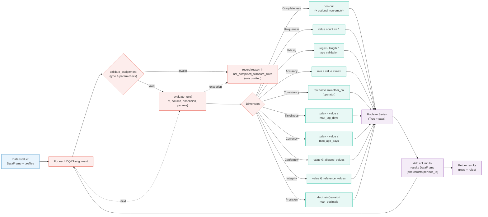
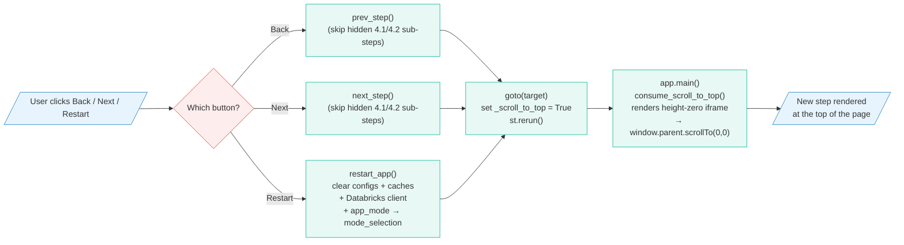
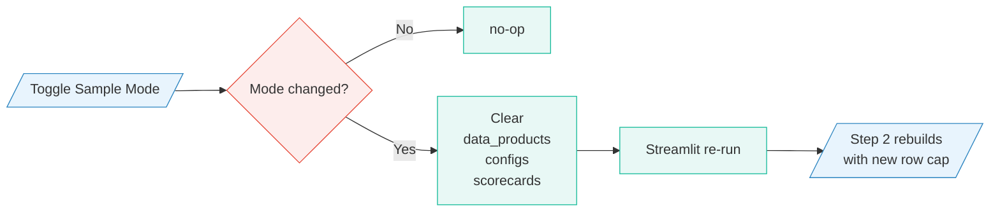
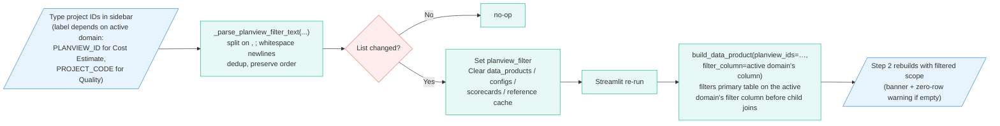

# Data Quality Scorecard App - Flowchart

End-to-end flow showing the user's journey. The app opens on a **mode picker** (`mode_selection`): **One-click mode** takes only a domain + systems and auto-builds everything (custom rules only, required CDEs, default options, equal weights, scorecards, CSVs) landing straight on the dashboard, while **Step-by-step mode** runs the manual workflow below (Step 0 picks the domain, Steps 1–6 run the DQ workflow, Step 7 is the optional ML Lab). The diagrams show the data transformations behind each step and what is persisted to session state.

> Rendered with Mermaid. View on GitHub or any Mermaid-aware viewer.

---

## End-to-End User & Data Flow

```mermaid
flowchart TD
    START([User launches app]) --> INIT["init_state()<br/>load Settings (.env locally; app.yaml env<br/>in Databricks Apps)<br/>session_state.app_mode = None<br/>session_state.domain = None"]
    INIT --> MODE{"DATA_SOURCE<br/>= ?"}
    MODE -->|mock| MOCK["src/mock_data.py<br/>seed = 42"]
    MODE -->|databricks| SF["src/databricks_client.py<br/>SQL Warehouse connection<br/>(headless auth: app service<br/>principal / local PAT)"]
    MOCK --> READY[Fetcher ready]
    SF --> READY

    %% ---------- Entry - Mode Selection ----------
    READY --> ENTRY[/"Entry - Mode Selection"/]
    ENTRY --> MODEPICK{"Pick mode"}
    MODEPICK -->|🛠️ Step-by-step| ST0
    MODEPICK -->|⚡ One-click| OC[/"One-click - Domain + Systems"/]

    %% ---------- One-click branch ----------
    OC --> OCPICK["User picks a domain<br/>+ ≥1 system, then Generate"]
    OCPICK --> OCVAL{"Domain + ≥1 system<br/>with custom rules?"}
    OCVAL -->|No| OC
    OCVAL -->|Yes| OCRUN["run_one_click():<br/>build_multiple + profile + prefetch refs<br/>custom rules only · required CDEs<br/>default options · equal weights<br/>compute_scorecard · validate CSV"]
    OCRUN --> OCQ{"Scored<br/>≥ 1 system?"}
    OCQ -->|No - blocking| OC
    OCQ -->|Yes| SAVEOC["session_state: selected_systems,<br/>data_products, configs, scorecards,<br/>one_click_summary"]
    SAVEOC --> ST6

    %% ---------- Step 0 ----------
    ST0[/"Step 0 - Domain Selection (Step-by-step)"/]
    ST0 --> DOMAINPICK["User picks a domain<br/>(Cost Estimate, Quality, ...)"]
    DOMAINPICK --> DOMAINQ{"Domain<br/>picked?"}
    DOMAINQ -->|No| ST0
    DOMAINQ -->|Yes| SAVE0["session_state.domain<br/>(prior workflow state cleared on switch)"]

    %% ---------- Step 1 ----------
    SAVE0 --> ST1[/"Step 1 - System Selection"/]
    ST1 --> PICK["User checks systems<br/>(from active domain - e.g.<br/>ADR / ACCE / EPT for Cost Estimate,<br/>SQS for Quality)"]
    PICK --> PICKQ{"≥ 1 system<br/>selected?"}
    PICKQ -->|No| ST1
    PICKQ -->|Yes| SAVE1["session_state.selected_systems"]

    %% ---------- Step 2 ----------
    SAVE1 --> ST2[/"Step 2 - Data Product Review"/]
    ST2 --> PVF["Apply sidebar Project filter<br/>(domain-aware - column from<br/>active DomainDef.project_filter:<br/>PLANVIEW_ID for Cost Estimate,<br/>PROJECT_CODE for Quality)"]
    PVF --> BUILD["For each system:<br/>build_data_product(planview_ids=…,<br/>filter_column=…)"]
    BUILD --> JOIN["LEFT JOIN child tables<br/>on join_key"]
    JOIN --> AGG["Aggregate 1:N<br/>numeric → SUM<br/>others → first non-null"]
    AGG --> PRX["Prefix non-primary<br/>table columns"]
    PRX --> PROF["profile_dataframe()<br/>per-column profiles"]
    PROF --> SHOW2["Show table summary<br/>+ column profile preview<br/>+ project-filter banner (if active)"]
    SHOW2 --> SAVE2["session_state.data_products"]

    %% ---------- Step 3 ----------
    SAVE2 --> ST3[/"Step 3 - CDE Selection"/]
    ST3 --> GRID["Profile grid (st.data_editor)<br/>+ hover badges for selected CDEs"]
    GRID --> CDEQ{"≥ 1 CDE<br/>selected per product?"}
    CDEQ -->|No| ST3
    CDEQ -->|Yes| SAVE3["config.cdes"]

    %% ---------- Step 4 - DQR source selection ----------
    SAVE3 --> ST4[/"Step 4 - DQR Sources"/]
    ST4 --> SRCQ{"Source(s)<br/>selected?"}
    SRCQ -->|None| ST4
    SRCQ -->|Standard or Both| SAVE4S["config.dqr_sources<br/>config.source_weights"]
    SRCQ -->|Custom only| SAVE4C["config.dqr_sources<br/>config.source_weights"]

    %% ---------- Step 4.1 - Standard ----------
    SAVE4S --> ST4_1[/"Step 4.1 - Standard DQR"/]
    ST4_1 --> SUG["suggest_assignments_for_cde()<br/>heuristic by column type/name"]
    SUG --> EDIT["User toggles dimensions<br/>+ edits parameters<br/>(min/max, regex,<br/>allowed_values, …)"]
    EDIT --> VALCHK{"validate_assignment(...)<br/>per dimension<br/>(type & param check)"}
    VALCHK -->|errors| VALWARN["❌ inline error +<br/>top-level summary;<br/>Next disabled"]
    VALWARN --> EDIT
    VALCHK -->|warnings| VALOK["⚠ inline warning<br/>(non-blocking)"]
    VALCHK -->|valid| VALOK2["✅ compatible badge"]
    VALOK --> SAVE4_STD["config.assignments"]
    VALOK2 --> SAVE4_STD

    %% ---------- Step 4.2 - Custom ----------
    SAVE4_STD --> ST4_2{Custom<br/>selected?}
    SAVE4C --> ST4_2
    ST4_2 -->|Yes| ST4_2R[/"Step 4.2 - Custom DQR"/]
    ST4_2R --> CARDS["Render rule cards from<br/>get_available_custom_dqr_rules(dp);<br/>statistical-outlier rules also expose<br/>a threshold selectbox<br/>(percentile P75…P99 or IQR k 1.5…3.0)<br/>persisted to assignment.params"]
    CARDS --> CDECHK{"Each selected rule's<br/>required_columns ⊆ cfg.cdes?"}
    CDECHK -->|No| CDEWARN["Per-card ⚠ warning + top-level<br/>error; Next disabled"]
    CDEWARN --> CARDS
    CDECHK -->|Yes| SAVE4_CUS["config.custom_assignments"]
    ST4_2 -->|No| SAVE4_CUS_SKIP[skip 4.2]

    %% ---------- Step 5 ----------
    SAVE4_CUS --> ST5[/"Step 5 - Weight Assignment"/]
    SAVE4_CUS_SKIP --> ST5
    ST5 --> BLANK["Inputs start at 0%<br/>for both Standard + Custom rules"]
    BLANK --> WCHOICE{"How to weight?"}
    WCHOICE -->|Equally| EQ["Click 'Distribute equally'<br/>distribute_equally(100, n)<br/>integer-cents split"]
    WCHOICE -->|Custom| MAN["Per-rule inputs<br/>(capped so Σ ≤ 100<br/>within each source)"]
    EQ --> SUMCHK
    MAN --> SUMCHK{"Σ weights<br/>≈ 100 in each<br/>active source?"}
    SUMCHK -->|No| ST5
    SUMCHK -->|Yes| SAVE5["assignment.weight set<br/>(standard + custom)"]

    %% ---------- Step 6 ----------
    SAVE5 --> ST6[/"Step 6 - Dashboard"/]
    ST6 --> EVAL_S["evaluate_all_safe() for Standard<br/>(skips & records incompatible rules<br/>in not_computed_standard_rules)<br/>+ evaluate_custom_rules() for Custom"]
    EVAL_S --> NORM["Normalize weights<br/>within each source<br/>(sum = 1.0)"]
    NORM --> SCORE["Per-source row score = Σ(pass·w)·100<br/>Combined = w_std·std + w_cus·cus"]
    SCORE --> AGGS["Aggregate:<br/>per-rule, per-CDE,<br/>per-dimension,<br/>standard / custom subscores,<br/>overall"]
    AGGS --> BUCKET["Bucket rows<br/>green ≥ 80<br/>yellow ≥ 60<br/>red < 60"]
    BUCKET --> RENDER["Render dashboard:<br/>gauge, source breakdown,<br/>By CDE / Dimension (Standard +<br/>Custom blended, click a bar to<br/>drill down to the failing rows),<br/>custom rules tab (select a row to<br/>drill down), worst rows (with<br/>per-rule score columns + weight in<br/>header + reference-dataset columns),<br/>History tab (auto-persisted trend +<br/>what-changed drift + drop alert),<br/>executive HTML report download"]
    RENDER --> EXPORT{User exports<br/>or opens lab?}
    EXPORT -->|CSV| CSVOUT["rows + row score + status +<br/>one column per Standard / Custom<br/>rule with the row's score<br/>(weight in column header) +<br/>reference-dataset columns<br/>(suffixed with origin dataset)"]
    EXPORT -->|JSON| JSONOUT["config + scorecard summary"]
    EXPORT -->|🧪 ML Lab beta| ST7[/"Step 7 - 🧪 ML Lab (beta)<br/>read-only experimental analytics"/]
    EXPORT -->|None| END([End of session])
    CSVOUT --> END
    JSONOUT --> END

    %% ---------- Step 7 - ML Lab ----------
    ST7 --> LAB9["9 tabs:<br/>🔎 Row Anomalies · 🎯 Rule Impact ·<br/>🌿 CDE Clustering · ⚖️ Weight Sensitivity ·<br/>🔭 Cross-DP Comparison · 📜 Run History ·<br/>🧠 Risk Model · 💡 DQR Recommendations ·<br/>🧩 Row Explainability"]
    LAB9 --> LABSTATE["session_state.ml_lab_runs<br/>(snapshot history; lab-owned)"]
    LABSTATE --> END

    classDef step fill:#E8F4FD,stroke:#2E86C1,color:#1B4F72
    classDef proc fill:#E8F8F5,stroke:#1ABC9C,color:#0E6655
    classDef state fill:#FEF9E7,stroke:#F1C40F,color:#7D6608
    classDef decision fill:#FDEDEC,stroke:#E74C3C,color:#7B241C
    classDef out fill:#F4ECF7,stroke:#8E44AD,color:#4A235A
    classDef beta fill:#F5E8FF,stroke:#7C3AED,color:#4C1D95

    class ENTRY,OC,ST0,ST1,ST2,ST3,ST4,ST4_1,ST4_2R,ST5,ST6 step
    class ST7,LAB9 beta
    class PVF,BUILD,JOIN,AGG,PRX,PROF,SHOW2,GRID,SUG,EDIT,CARDS,CDEWARN,VALWARN,VALOK,VALOK2,BLANK,EQ,MAN,EVAL_S,NORM,SCORE,AGGS,BUCKET,RENDER,INIT,MOCK,SF,READY,OCPICK,OCRUN proc
    class SAVE1,SAVE2,SAVE3,SAVE4S,SAVE4C,SAVE4_STD,SAVE4_CUS,SAVE4_CUS_SKIP,SAVE5,LABSTATE,SAVEOC state
    class MODE,PICKQ,CDEQ,SRCQ,ST4_2,CDECHK,VALCHK,WCHOICE,SUMCHK,EXPORT,MODEPICK,OCVAL,OCQ decision
    class CSVOUT,JSONOUT,END out
```



---

## Step-by-Step Summary

| # | Step | User action | System action | Persisted |
|---|------|-------------|---------------|-----------|
| — | **Mode Selection** (entry) | Pick **⚡ One-click** or **🛠️ Step-by-step**, or **📂 open a saved project** (rebuilds data products, applies the saved config, lands on the dashboard in Step-by-step mode) | Set `app_mode`; route to the One-click step (One-click) or Step 0 (Step-by-step). Mode-aware visibility hides the other flow's steps. A **📊 Usage & audit** button opens the standalone Adoption admin page | `app_mode` (+ on project open: `domain`, `selected_systems`, `data_products`, `configs`, `loaded_project_name`) |
| — | **📊 Adoption & audit** (admin, standalone) | Inspect usage: unique users, app opens, runs/exports counts, runs-per-week trend, adoption by domain/system, per-user activity, unified audit trail | Read-only over persisted events/runs/project versions (`src/telemetry.py`); reached from the entry screen; no mode/domain required | — |
| — | **⚡ One-click** | Pick a domain + systems, click **Generate** | `run_one_click()`: build + profile each DP, prefetch refs, select custom rules only with default options, derive required CDEs, distribute weights equally, compute scorecards, validate CSV; land on the dashboard with a summary banner. Blocking only on no domain / no system / no system with custom rules / nothing scored | `selected_systems`, `data_products`, `configs`, `scorecards`, `one_click_summary` |
| 0 | Domain Selection (Step-by-step) | Pick a domain card (Cost Estimate / Quality / ...) | Set the active domain on session-state; switching wipes downstream selections so Step 1 starts clean | `domain` |
| 1 | System Selection | Check 1+ of the active domain's systems (e.g. ADR / ACCE / EPT for Cost Estimate, SQS for Quality) | Validate selection, advance | `selected_systems` |
| 2 | Data Product Review | Inspect table previews; optionally restrict to one or more project identifiers via the **domain-aware** sidebar Project filter (Cost Estimate → `PLANVIEW_ID`, Quality → `PROJECT_CODE`; configured per `DomainDef.project_filter`) | Build joined Data Product (filtered on the active domain's filter column when set), profile columns | `data_products` |
| 3 | CDE Selection | Tick the **Pick as CDE** checkbox in the profile grid; selected columns surface as hover-tooltip badges above the grid. Each DP card also exposes a **🎯 Select all CDEs required by Custom DQRs** shortcut that unions every 🎯-flagged column into the current selection on click (existing manual picks are preserved). | Create empty config per product | `configs[*].cdes` |
| 4 | DQR Sources | Pick Standard / Custom / both, split source-level weight | Validate ≥ 1 source per DP; auto-pin 100% if single | `configs[*].dqr_sources`, `configs[*].source_weights` |
| 4.1 | Standard DQR | Toggle dimensions + edit params per CDE; suggestions are surfaced with a **💡 _suggested_** badge but are NOT pre-applied, the user either ticks dimensions individually or clicks the per-DP **💡 Apply all suggested DQRs** shortcut to enable every still-pending suggestion at once. | Compute suggestions per CDE; build `DQRAssignment` list - only for DPs that picked Standard. Each assignment is run through `validate_assignment()` against the CDE's profile; ✅/⚠/❌ badges surface compatibility status and **Next** stays disabled while any blocking error exists. Validation re-runs on every Streamlit rerun so changes to the CDE / dimension / compare_column / operator / threshold flip the badge instantly. | `configs[*].assignments` |
| 4.2 | Custom DQR | Tick rule cards from the catalog; each DP card exposes a **✓ Select all Custom DQRs** shortcut that ticks every available rule for that DP on click. Statistical-outlier rules (E3, E6, A3, A7, A8, AC3, AC7, AC8) additionally surface a **threshold selectbox**: percentile (P75 / **P90 default** / P95 / P99) for E3 / A3 / AC3, IQR multiplier (**1.5× default** / 2.0× / 3.0×) for E6 / A7 / A8 / AC7 / AC8. E3 and A3 also expose two behavioural toggles - **project_scoped** (per-`PLANVIEW_ID` percentile baseline) and **detect_uniform_mapping** (also fail material 1:1 buckets). All picked values ride on the assignment's `params` dict and are consumed by the rule's `check` callable at evaluation time; defaults reproduce the rule's documented baseline so untouched cards behave identically to the pre-feature flow. | Build `CustomDQRAssignment` list - only for DPs that picked Custom; empty-state if none. Validate each ticked rule's `required_columns` against `cfg.cdes`; surface a per-card success / warning badge and block **Next** until every selected rule's required CDEs are picked. Per-rule options (toggles + threshold selectboxes) are persisted to `assignment.params` and survive re-renders. | `configs[*].custom_assignments` |
| 5 | Weight Assignment | Inputs start blank for both sources; user types per-rule weights or clicks **Distribute equally** | Live-validate Σ ≤ 100 within each active source | `assignment.weight`, `custom_assignment.weight` |
| 6 | Dashboard | View results / export | Run standard + custom engines; combine subscores via source weights; render | `scorecards[*]` (+ CSV / JSON) |
| 7 | 🧪 **ML Lab (beta)** | Inspect anomalies, rule impact, CDE clusters, weight sensitivity, cross-DP comparison, run-history drift, supervised risk, DQR recommendations, row explainability; optionally toggle **🔬 Use scikit-learn** | Re-derive per-row pass/fail matrix via the same evaluators; run unsupervised + statistical views on top - **read-only**, no changes to `data_products` / `configs` / `scorecards` | `ml_lab_runs` (lab-owned snapshot history; reset by Restart) |

---

## ML Lab - Detail (Step 7, beta)

End-to-end view of what the user sees inside the experimental Step 7 and which `src/ml_lab.py` function each tab routes to. Every algorithm is read-only: the lab consumes the `DataProduct` / `DataProductConfig` / `ScorecardResult` triple the main flow already produced and only writes to its own session-state key (`ml_lab_runs`).

```mermaid
flowchart TD
    ENTRY([User on Step 6 Dashboard]) --> OPEN{Open ML Lab?}
    OPEN -->|🧪 button| GOTO["goto('ml_lab')<br/>scroll-to-top"]
    GOTO --> HDR["Step 7 header:<br/>🧪 EXPERIMENTAL · BETA pill<br/>+ 🔬 sklearn detection badge"]
    HDR --> PICK["Pick a Data Product<br/>+ 🔬 'Use scikit-learn' toggle"]
    PICK --> TABS{Which tab?}

    %% Tab 1 - Row Anomalies
    TABS -->|🔎 Row Anomalies| T1["compute_row_anomalies"]
    T1 --> T1IF{sklearn<br/>engaged?}
    T1IF -->|yes| T1A["robust z + rare-failure<br/>+ IsolationForest blend"]
    T1IF -->|no| T1B["robust z + rare-failure only"]
    T1A --> T1OUT["Top-N anomaly table<br/>+ histogram + rule rarity panel"]
    T1B --> T1OUT

    %% Tab 2 - Rule Impact
    TABS -->|🎯 Rule Impact| T2["compute_rule_impact<br/>(exact LOO; filters non-evaluated rules<br/>so baseline == standard_score)"]
    T2 --> T2OUT["LOO table + criticality bar chart"]

    %% Tab 3 - CDE Clustering
    TABS -->|🌿 CDE Clustering| T3["compute_cde_profile_clusters<br/>robust standardize → cluster → PCA"]
    T3 --> T3IF{sklearn?}
    T3IF -->|yes| T3A["sklearn KMeans + PCA"]
    T3IF -->|no| T3B["numpy k-means++ + SVD-PCA"]
    T3A --> T3OUT["2-D scatter + cluster summary"]
    T3B --> T3OUT

    %% Tab 4 - Weight Sensitivity
    TABS -->|⚖️ Weight Sensitivity| T4["simulate_weight_perturbation<br/>Dirichlet(α = w_norm·k) Monte-Carlo"]
    T4 --> T4OUT["Histogram + baseline /<br/>P05 / P95 / mean / std"]

    %% Tab 5 - Cross-DP
    TABS -->|🔭 Cross-DP Comparison| T5["compare_data_products<br/>robust z (MAD); flag |z|>1.5"]
    T5 --> T5OUT["Bar chart + table +<br/>anomalous-DP warning"]

    %% Tab 6 - Run History
    TABS -->|📜 Run History| T6BAR{Action?}
    T6BAR -->|📸 Snapshot| T6A["snapshot_scorecard()<br/>append to ml_lab_runs"]
    T6BAR -.->|📂 Upload JSON<br/>(under maintenance)| T6B["load_snapshot_from_json"]
    T6BAR -.->|📂 Upload CSV<br/>(under maintenance)| T6C["load_snapshot_from_csv<br/>(reconstructs histogram)"]
    T6BAR -->|💾 Export| T6D["JSON download of full history"]
    T6BAR -->|🗑 Clear| T6E["session_state.ml_lab_runs = []"]
    T6BAR -->|Pick A, B| T6F["compute_drift(snap_a, snap_b)"]
    T6A --> T6STATE["ml_lab_runs updated"]
    T6B --> T6STATE
    T6C --> T6STATE
    T6E --> T6STATE
    T6STATE --> TREND["Per-DP trend chart"]
    T6F --> T6OUT["PSI + KS + per-rule Δ +<br/>per-CDE Δ + per-dim Δ"]

    %% Tab 7 - Risk Model
    TABS -->|🧠 Risk Model| T7["train_risk_classifier<br/>X = fail flags · y = row_score < threshold_yellow"]
    T7 --> T7IF{sklearn AND<br/>target has variance?}
    T7IF -->|yes| T7A["sklearn LogisticRegression(L2)"]
    T7IF -->|no| T7B["numpy gradient-descent LR"]
    T7A --> T7OUT["Coefficient table + odds_ratio<br/>+ confusion + risk-prob histogram"]
    T7B --> T7OUT

    %% Tab 8 - DQR Recommendations
    TABS -->|💡 DQR Recommendations| T8["recommend_dqrs_for_cde<br/>cosine on profile vectors<br/>+ heuristics; drops already-assigned"]
    T8 --> T8OUT["Table:<br/>cde · recommendation · source ·<br/>reason · similar_to · similarity"]

    %% Tab 9 - Row Explainability
    TABS -->|🧩 Row Explainability| T9PICK["Pick row (number input<br/>or 🔴 Worst / 🟡 Median)"]
    T9PICK --> T9["explain_row_score"]
    T9 --> T9OUT["Waterfall<br/>(100 → −CDE₁ → ... → row_score)<br/>+ per-CDE deficit + per-rule contrib"]

    %% Nav at the bottom, every path returns control
    T1OUT --> NAV{Nav?}
    T2OUT --> NAV
    T3OUT --> NAV
    T4OUT --> NAV
    T5OUT --> NAV
    T6OUT --> NAV
    TREND --> NAV
    T7OUT --> NAV
    T8OUT --> NAV
    T9OUT --> NAV
    NAV -->|⬅ Back| BACKD["goto('dashboard')"]
    NAV -->|📊 Back to Dashboard| BACKD
    NAV -->|🔄 Restart| RESET["restart_app()<br/>(also clears ml_lab_runs)"]
    NAV -->|Switch tab| TABS

    classDef in fill:#E8F4FD,stroke:#2E86C1
    classDef proc fill:#E8F8F5,stroke:#1ABC9C
    classDef ctrl fill:#FDEDEC,stroke:#E74C3C
    classDef out fill:#F4ECF7,stroke:#8E44AD
    classDef beta fill:#F5E8FF,stroke:#7C3AED
    classDef state fill:#FEF9E7,stroke:#F1C40F

    class ENTRY,GOTO,HDR,PICK in
    class T1,T1A,T1B,T2,T3,T3A,T3B,T4,T5,T6A,T6B,T6C,T6D,T6E,T6F,T7,T7A,T7B,T8,T9,T9PICK proc
    class OPEN,TABS,T1IF,T3IF,T6BAR,T7IF,NAV ctrl
    class T1OUT,T2OUT,T3OUT,T4OUT,T5OUT,T6OUT,TREND,T7OUT,T8OUT,T9OUT out
    class T6STATE,BACKD,RESET state
```

**Read-only contract**: none of the arrows ever feed back into `data_products`, `configs` or `scorecards`. The lab can only mutate `ml_lab_runs` (its own session-state key) and emit downloads.

**Optional sklearn**: three tabs support a swap-in (Row Anomalies → IsolationForest, CDE Clustering → KMeans/PCA, Risk Model → LogisticRegression). The numpy fallbacks always work; the swap-in only fires when scikit-learn is importable AND the `🔬 Use scikit-learn` toggle is on.

For per-algorithm formulas, parameters, the snapshot schema and the drift conventions, see [ML_LAB.md](ML_LAB.md).

---

## Rule Evaluation - Detail



---

## Decision & Validation Points

- **Entry (Mode Selection)**: the app routes here until `app_mode` is set. **One-click** requires a domain + ≥1 system that has custom rules before Generate is enabled; systems without custom rules are skipped (One-click is custom-only), and if none of the selected systems can be scored the user stays on the step with a reason. **Step-by-step** routes to Step 0 and proceeds exactly as below. `_visible_steps()` hides the other flow's steps based on `app_mode`.
- **Step 1 → 2**: at least one system must be selected.
- **Step 2 → 3**: cached Data Products are reused unless **Sample Mode** is toggled, the **Project filter** (domain-aware - `PLANVIEW_ID` for Cost Estimate, `PROJECT_CODE` for Quality; see `DomainDef.project_filter`) changes, or systems change (any of these invalidates `data_products` / `configs` / `scorecards` and rebuilds on the next render). When the project filter is set, Step 2 shows a banner naming the active identifiers and warns if any system matched zero rows.
- **Step 3 → 4**: at least one CDE must be selected per Data Product.
- **Step 4 → 4.1 / 4.2**: at least one DQR source (Standard, Custom) must be selected per Data Product. Source-level weights always sum to 100% (auto-pinned when only one source).
- **Step 4.1 → next**: visited only for DPs with `standard` in `dqr_sources`. Standard DQR assignments accumulate per CDE. **Next is disabled** while any selected dimension/parameter combination is incompatible with the CDE's data type (e.g. a date CDE compared against a numeric column, Accuracy on a string column, an out-of-range bound). The same validation also runs in Step 6: rules that somehow remain incompatible, or that raise an unexpected runtime error - are recorded in `ScorecardResult.not_computed_standard_rules` and contribute 0 to the score, so the dashboard never crashes on a configuration the engine cannot evaluate.
- **Step 4.2 → next**: visited only for DPs with `custom` in `dqr_sources`. Empty-state shown when the catalog has no rules for the DP. **Next is disabled** while any ticked Custom DQR's `required_columns` (physical column names) are not all present in `cfg.cdes` from Step 3, the user either adds the missing CDEs (going back to Step 3) or unticks the offending rule. Rules with no `required_columns` never block.
- **Step 5 → 6**: rule-level weights must sum to ≈ 100 within each active source (live indicator turns green / red).
- **Step 6**: thresholds for green / yellow / red come from `Settings.threshold_green` and `Settings.threshold_yellow` (env vars `THRESHOLD_GREEN` / `THRESHOLD_YELLOW`, configurable in `.env` for local dev). Final overall score combines Standard and Custom subscores by their Step-4 source weights.
- **Step 6 → 7**: the ML Lab entry is hidden until a scorecard exists in session state. The `🧪 ML Lab (beta)` button is rendered in the Step 6 nav row regardless, but its `goto("ml_lab")` only lands somewhere useful once `scorecards` is non-empty - otherwise Step 7 shows a friendly empty state directing the user back to the Dashboard. Once a scorecard exists, Step 7 also appears in the sidebar progress stepper.

---

## Step Navigation (cross-cutting)

Every step renders the same nav row at the bottom. Restart is exposed on
**every** step, not just the dashboard, so the user can always abort the
workflow without scrolling to the end. After Back / Next / Restart fire, a
scroll-to-top component runs on the next render so the user lands at the new
step's header.



---

## Sample-Mode Toggle (cross-cutting)

The sidebar **Sample Mode** switch caps each table to `MAX_ROWS_PER_TABLE`. Toggling it triggers cache invalidation:



---

## Project Filter (cross-cutting)

The sidebar **Project filter** textarea (`render_planview_filter`) restricts the entire app to one or more project identifiers. The widget is **domain-aware**: each `DomainDef` declares its `ProjectFilterDef` so the filter column, label, placeholder and help text are sourced from `get_active_domain().project_filter` (Cost Estimate → `PLANVIEW_ID`, Quality → `PROJECT_CODE`). The widget is **hidden until Step 0 sets a domain** - no filter column is meaningful before then. Input is parsed leniently (commas / semicolons / whitespace / newlines all work as separators; duplicates are dropped while preserving first-occurrence order). Changing the parsed list invalidates the same caches as the Sample-Mode toggle and the next Step 2 render rebuilds with the new project scope:



---

See also: [DOCUMENTATION.md](DOCUMENTATION.md), [BLOCK_DIAGRAM.md](BLOCK_DIAGRAM.md), [STANDARD_RULES.md](STANDARD_RULES.md), [CUSTOM_RULES.md](CUSTOM_RULES.md), [ML_LAB.md](ML_LAB.md).
