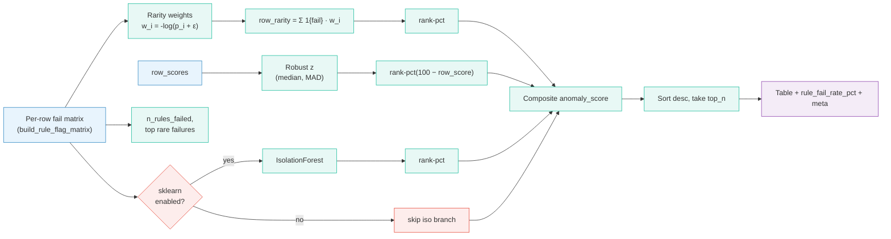
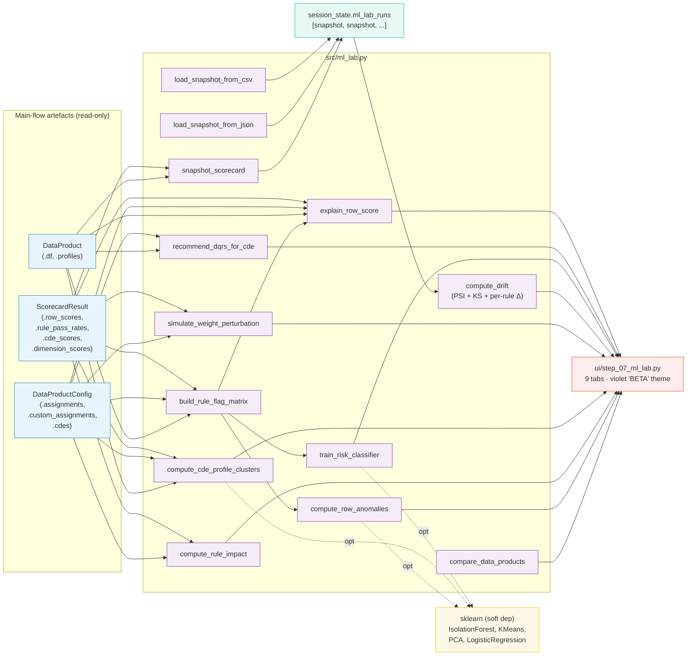

# 🧪 ML Lab - Reference (Beta)

The **ML Lab** is the experimental Step 7 of the Data Quality Scorecard app. It is a **read-only**, **unsupervised-first** sandbox that runs Machine-Learning / statistical-analytics views *on top of* the rules-based scorecard produced in Step 6, it never mutates any score, weight, rule or configuration the main flow generates.

This document is the canonical reference for everything the lab does: algorithms, parameters, UI, data flow, extension points, and limitations.

> 🧭 Where it sits in the workflow:
> System Selection → Data Product Review → CDE Selection → DQR Sources → Standard / Custom DQRs → Weights → **Dashboard** → **🧪 ML Lab (beta)** ← *you are here*

---

## 1. Philosophy & Guarantees

| Principle | What it means in practice |
|-----------|---------------------------|
| **Read-only** | None of the lab's code paths touch `data_products`, `configs`, `scorecards`, `selected_systems`, `planview_filter`, or any session-state key the rules-based flow owns. Re-deriving the per-row pass/fail matrix uses the same `evaluate_all_safe` / `evaluate_custom_rules` the dashboard uses, so semantics never drift. |
| **Complement, not replacement** | Every tab in the lab is a *view* on artefacts the rules-based scorecard already computed. The lab cannot "score" anything on its own; if you delete every DQR the lab has nothing to show. |
| **Unsupervised by default** | The lab does not require labels or historical data to be useful. The only "supervised" view (Risk Model) derives its labels from the RED-row threshold the user already configured, so it works on any single run. |
| **Interpretable** | Every algorithm has a plain-language explanation rendered inline, and the underlying math is either exact (leave-one-out, row-score waterfall) or admits a clear intuition (`-log(fail_rate)`, robust MAD-z, PSI). |
| **Soft dependency on sklearn** | scikit-learn is listed in `requirements.txt` but the lab works without it. Each tab that can use sklearn falls back to a numpy implementation when the library is missing OR when the user keeps the `🔬 Use scikit-learn` toggle off. |
| **Isolated UI** | Step 7 is wrapped in violet/lavender accents and a permanent **BETA** badge so the user always knows they are in experimental territory. |

---

## 2. Visibility & Navigation

The ML Lab is the 9th entry in `STEPS` (see [utils/session_state.py](../utils/session_state.py)). Its visibility predicate `_ml_lab_visible` keeps it hidden from the sidebar stepper until either of:

1. `st.session_state.scorecards` is non-empty, i.e. the user has rendered the Dashboard at least once during this session, OR
2. `current_step == "ml_lab"` (defensive: never hide the page while the user is on it).

Three discovery paths land on the lab:

| Where | How |
|-------|-----|
| Dashboard nav row (Step 6) | **🧪 ML Lab (beta)** button next to *Back* / *Restart* |
| Sidebar stepper | **🧪 ML Lab (beta)** entry, visible once a scorecard exists |
| Direct `goto("ml_lab")` call | Any future code path can navigate in programmatically |

`restart_app()` clears `ml_lab_runs` along with the rest of the session-owned state, so a Restart wipes the lab's history too.

---

## 3. Module Reference (`src/ml_lab.py`)

All algorithms live in a single file (`src/ml_lab.py`) so the UI layer
stays a thin presentation shim. The UI was partitioned by tab into
[ui/step_07/](../ui/step_07/) (one module per tab + a `_shared.py`
carrying CSS / banner / `_ensure_scorecards`); [ui/step_07_ml_lab.py](../ui/step_07_ml_lab.py)
is now a slim orchestrator that wires those tab renderers into
`st.tabs(...)`. Public functions of the algorithm layer:

### 3.1 sklearn detection

| Function | Purpose |
|----------|---------|
| `_sklearn_available()` | Returns True iff `import sklearn` succeeds. Cheap to call repeatedly (Python caches the import). |
| `sklearn_status()` | `{"available": bool, "version": str \| None}` - used by the UI to render the "🔬 sklearn detected" badge. |

### 3.2 Pass/fail flag matrix

| Function | Purpose |
|----------|---------|
| `build_rule_flag_matrix(dp, config)` | Returns `(flags, rule_meta)`. `flags` is a per-row Boolean DataFrame with one column per *successfully evaluated* rule (True = passed). Rules that returned a "Not computed" / "Not evaluated" reason on the dashboard are simply omitted. `rule_meta[rule_id]` carries `{source, label, weight}` for pretty display. |

### 3.3 Core unsupervised analytics

| Function | Purpose | Signal(s) |
|----------|---------|-----------|
| `compute_row_anomalies(dp, config, result, top_n, rarity_weight, use_sklearn)` | Per-row anomaly score | Robust MAD-z on `row_score` ⊕ rare-failure score `Σ -log(fail_rate)` ⊕ (optional) IsolationForest score |
| `compute_rule_impact(config, result)` | Exact per-rule leave-one-out impact | Linear LOO math (`baseline = Σ w_i · pr_i`; LOO removes rule i and renormalizes the remainder) |
| `compute_cde_profile_clusters(dp, config, result, n_clusters, seed, use_sklearn)` | k-means on standardized profile + score features, projected to 2D via SVD-PCA (numpy) or sklearn's PCA | Robust standardize + k-means++ + SVD-PCA |
| `simulate_weight_perturbation(config, result, n_simulations, jitter, seed)` | Dirichlet Monte-Carlo around current Standard weights → distribution of resulting sub-scores | Dirichlet sampling + linear score combination |
| `compare_data_products(scorecards)` | Robust-z (MAD) across DPs in the current session | MAD-based outlier flag (`|z| > 1.5`) |

### 3.4 Run history (snapshots, drift)

| Function | Purpose |
|----------|---------|
| `snapshot_scorecard(dp_code, dp, result, label=None)` | Captures a JSON-serialisable snapshot of one DP's current scorecard (overall score, rule pass rates, CDE / dimension scores, row-score histogram in 20 bins of [0, 100], thresholds, row buckets). |
| `load_snapshot_from_json(file_bytes, source="upload-json")` | Parses a `*_scorecard.json` exported by Step 6 into the same snapshot schema. Row-score histogram is `None` (JSON export doesn't carry per-row data). **UI upload entry point is temporarily under maintenance; this loader is retained for the upcoming auto-persist work.** |
| `load_snapshot_from_csv(file_bytes, dp_code="?", label=None)` | Parses a `*_row_scores.csv` exported by Step 6 into a snapshot - recovers the per-row histogram from `_row_score` and the per-rule pass rates by averaging the `STD · …` / `CUSTOM · …` columns. **UI upload entry point temporarily under maintenance (loader retained).** |
| `compute_drift(snap_a, snap_b, rule_delta_threshold=5.0)` | PSI + KS on row-score histograms (when both snapshots carry them) + per-rule / per-CDE / per-dimension Δ tables with a `flagged` column (`|Δ| ≥ threshold`). |
| `_psi_from_histograms`, `_ks_from_histograms` | Internal helpers; clipped against `eps = 1e-4` to avoid `log(0)`. |

### 3.5 Supervised + advanced

| Function | Purpose |
|----------|---------|
| `train_risk_classifier(dp, config, result, use_sklearn=False)` | Logistic regression on per-rule fail flags → predicts RED status (`row_score < threshold_yellow`). Returns coefficient table, accuracy, base rate, confusion matrix, per-row risk probability. Sklearn (`LogisticRegression`) when enabled and importable; pure-numpy fallback (`_logreg_numpy`) otherwise. |
| `recommend_dqrs_for_cde(dp, config, other_scope=None, top_neighbors=3)` | Cross-DP DQR recommendations: cosine similarity on robust-standardized profile vectors finds the top-k neighbour CDEs across every DP in the session, the lab borrows their DQR dimensions, then merges in profile-driven heuristics (high nulls → Completeness, low cardinality → Conformity, date → Timeliness + Currency, …). Already-assigned dimensions are filtered out. |
| `explain_row_score(dp, config, result, row_index)` | SHAP-equivalent for the linear scoring model: decomposes `100 − row_score` into per-CDE deficits and per-rule contributions. Returns waterfall arrays ready for Plotly (`Perfect 100 → −CDE₁ → −CDE₂ → … → row_score`). |

---

## 4. Algorithms in Detail

### 4.1 Row Anomalies - robust z + rare failures + IsolationForest

**Goal**: surface rows whose pattern of rule *failures* is atypical, even if their raw score isn't the lowest one. This is what the dashboard's "Worst rows" tab cannot do (it sorts purely by `row_score`).

**Signals** (each normalised to a rank-percentile in [0, 1]):

1. **Robust z-score on `row_score`**: `(median(row_scores) − row_score) / (1.4826 × MAD)`. Positive = below the median = worse than typical.
2. **Rare-failure score**: for each rule, compute its global fail-rate `p_i`. The rarity weight is `w_i = -log(p_i + eps)` (failing a rule that 99 % of rows pass → `w ≈ 7`; failing a rule everyone fails → `w ≈ 0`). The row's rarity score is `Σ_i 1{row failed rule i} · w_i`.
3. **(Optional) IsolationForest score**: when the user toggles `🔬 Use scikit-learn` and sklearn is importable, the lab fits an `IsolationForest(n_estimators=120, contamination="auto")` on the per-row fail matrix and uses `-decision_function(X)` (higher = more anomalous) as the third signal.

**Composite**:

```
α = rarity_weight  ∈ [0, 1]   ← slider (default 0.7)

if iso engaged:
    anomaly = 0.7 · (α · rank(rarity) + (1−α) · rank(score_deficit)) + 0.30 · rank(iso)
else:
    anomaly = α · rank(rarity) + (1−α) · rank(score_deficit)
```

**Outputs** in the `table` DataFrame (sorted by `anomaly_score` descending):

| Column | Meaning |
|--------|---------|
| `row_score` | The row's actual quality score (0..100). |
| `robust_z` | MAD-z above the median (>0 = below median). |
| `rarity_score` | Raw `Σ -log(fail_rate)`. |
| `anomaly_score` | Composite rank-percentile blend (0..1). |
| `n_rules_failed` | Count of failing rules for this row. |
| `top_rare_failures` | Up to 3 rules failed, ranked by rarity weight. |
| `iso_forest_score` *(only when sklearn engaged)* | Rank-percentile of the IsolationForest score. |



---

### 4.2 Rule Impact - exact leave-one-out

**Goal**: identify rules that are *load-bearing* (removing them would drop the source sub-score) vs. *dragging* (their low pass-rate is pulling the score down).

**Why it's exact, not a simulation**: within one source, `score = Σ_i (w_i / Σ w) · pr_i × 100`. Linear in pass-rates → removing rule *i* and renormalising over the others is a closed-form computation, not an approximation.

**Per rule** (within its source):

| Column | Formula / meaning |
|--------|-------------------|
| `weight_pct` | User-configured weight |
| `pass_rate_pct` | From `result.rule_pass_rates` (or `custom_rule_pass_rates`) |
| `baseline_source_score` | Current source sub-score (matches `result.standard_score` / `result.custom_score`) |
| `loo_source_score` | Sub-score with this rule removed and remaining weights renormalised |
| `delta_vs_baseline` | `loo − baseline`. **< 0** = removal hurts → rule is *lifting*. **> 0** = removal helps → rule is *dragging*. |
| `criticality` | `\|delta\|` - magnitude of influence; used to sort the bar chart. |
| `potential_uplift_pct` | `w_i_normalized · (1 − pr_i) · 100` - points the sub-score would gain if this rule jumped to 100 % pass. |

The lab **filters out non-evaluated rules** (`not_computed_standard_rules`, `not_evaluated_custom_rules`) so the baseline reported here matches the dashboard's `standard_score` / `custom_score` exactly, same set of weights, same set of pass-rates.

---

### 4.3 CDE Clustering - k-means + PCA on profile + score signature

**Goal**: spot CDEs that "behave the same" so the user can audit them together.

**Feature vector per CDE**:

| Feature | Source |
|---------|--------|
| `null_pct` | `dp.profiles[cde].null_pct` |
| `distinct_ratio_pct` | `distinct_count / total_rows × 100` |
| `duplicate_ratio_pct` | `duplicate_count / non_null × 100` |
| `cde_score` | `result.cde_scores[cde]` (0..100) |
| `t_<dtype>` one-hot | 9 buckets: numeric / integer / float / datetime / date / string / categorical / id / boolean |

Features are **robust-standardized** (median / MAD) so a feature with naturally large magnitude (e.g. `distinct_ratio_pct` for IDs) doesn't dominate the distance metric.

**Backend**:

- **numpy fallback**: `_simple_kmeans` (k-means++ init, max 200 iterations) + `_pca_2d` (SVD).
- **sklearn swap-in** (toggle on, sklearn installed) - `sklearn.cluster.KMeans(n_init=10)` + `sklearn.decomposition.PCA(n_components=2)`. `explained_variance_ratio_` is read straight from the fitted PCA.

The number of clusters `k` is user-controlled (slider 2..min(6, n_cdes)). With fewer than 2 CDEs the tab shows a friendly empty state instead of trying to cluster.

---

### 4.4 Weight Sensitivity - Dirichlet Monte-Carlo

**Goal**: answer "how fragile is my Standard sub-score to the exact weights I chose?"

**Procedure**:

1. Normalize current weights to a probability simplex `w_norm` (summing to 1).
2. Translate the user's `jitter` slider (∈ (0, 1]) into a Dirichlet concentration `α = max(2, (1 − jitter) × 80 + 2)` and form `α_i = w_norm_i · α + ε`. Low jitter → tight cluster around current weights. High jitter → broad exploration.
3. Sample `n_simulations` weight vectors from `Dirichlet(α)`; for each, the resulting Standard sub-score is `(sampled @ pass_rates) × 100`.
4. Report: histogram + mean / std / p05 / p95 / min / max + baseline vline.

If P95 − P05 is small (a few points), the score is robust to weight choice; if it's wide (10–15+), small weight changes meaningfully move the score - worth re-discussing with the data owner.

---

### 4.5 Cross-DP Comparison - robust z (MAD) across DPs

**Goal**: highlight DPs whose overall score sits far from peers.

`z_i = (score_i − median(scores)) / (1.4826 × MAD)`. Flags `|z| > 1.5` as `Anomalous`; everything else is `In-line`. With a single DP the column reads `Single DP` (no comparison possible).

Reported columns: `overall_score`, `rows_green_pct`, `rows_yellow_pct`, `rows_red_pct`, `total_rows`, `n_rules_std`, `n_rules_cust`, `robust_z`, `status`.

---

### 4.6 Run History + Drift (PSI / KS)

**Snapshot schema** (`snapshot_scorecard`):

```python
{
    "id":          "snap_2026-05-16T02:36:38_EPT",
    "label":       "baseline",                   # user-friendly tag
    "timestamp":   "2026-05-16T02:36:38",
    "source":      "session" | "upload-json" | "upload-csv",
    "dp_code":     "EPT",
    "dp_name":     "EPT",
    "overall_score": 89.14,
    "threshold_green": 80.0,
    "threshold_yellow": 60.0,
    "total_rows":  50_000,
    "rows_green":  47_321,  "rows_yellow": 2_103, "rows_red": 576,
    "standard_score": 89.14,  "custom_score": None,
    "rule_pass_rates":        {rule_id: pct, ...},
    "custom_rule_pass_rates": {rule_id: pct, ...},
    "cde_scores":             {cde:      pct, ...},
    "dimension_scores":       {dim:      pct, ...},
    "row_score_hist": {
        "bin_edges": [0.0, 5.0, ..., 100.0],     # 21 edges = 20 bins
        "counts":    [12, 33, ..., 18_240],
        "mean": 89.1, "std": 18.4,
        "p05": 45.0, "p25": 80.0, "p50": 95.0, "p75": 100.0, "p95": 100.0,
        "n": 50_000,
    },
}
```

Snapshots live in `st.session_state["ml_lab_runs"]` (a list of these dicts). The lab provides four entry points:

| Action | Source | Carries histogram? |
|--------|--------|--------------------|
| 📸 *Snapshot current runs* | `session` | ✅ (computed from `result.row_scores`) |
| 📂 *Upload JSON* (from Step 6 export) | `upload-json` | ❌ (JSON export only carries the summary) |
| 📂 *Upload CSV* (from Step 6 export) | `upload-csv` | ✅ (reconstructed from `_row_score` column) |
| 💾 *Export history (JSON)* | - | round-trips the full session history to disk |

**Drift computation** (`compute_drift`):

```
overall_score_delta = score_b − score_a
PSI                = Σ (p_b − p_a) · ln(p_b / p_a)   ← bin probabilities, clipped at ε
KS                 = max |CDF_b(x) − CDF_a(x)|       ← L∞ on the cumulative hist
rule_table         = [{rule_id, score_a, score_b, delta, flagged} ...]   ← sort by |Δ| desc
cde_table          = idem for CDE scores
dimension_table    = idem for dimension scores
```

**PSI conventions** (rendered as the metric's delta-label):

| PSI range | Interpretation |
|-----------|----------------|
| < 0.10 | Negligible drift |
| 0.10 – 0.25 | Moderate drift, worth a look |
| > 0.25 | Significant drift, investigate |

PSI / KS need *both* snapshots to carry the row-score histogram (session snapshots and CSV uploads do; JSON uploads don't). When only one is available the PSI / KS metrics render as `-` but the per-rule / per-CDE / per-dim drift tables still work.

---

### 4.7 Risk Model - logistic regression on RED status

**Setup**:

- **X** = per-row fail flags (`1` = the rule FAILED for this row), one column per evaluated rule.
- **y** = `(row_score < threshold_yellow).astype(int)` - RED status.

**Backend**:

- **sklearn path** (toggle on, sklearn installed, target has both classes): `LogisticRegression(penalty="l2", C=1.0, solver="lbfgs", max_iter=500)`.
- **numpy fallback** (`_logreg_numpy`): tiny gradient-descent logistic regression with L2 (lr=0.1, 300 iters, l2=0.01). Same semantic as sklearn's coefficients.

**Why this is useful even though y is derived from X**:

The scorecard's `row_score` is a *weighted* linear combination of pass flags using the user's `weight_pct`. The logistic regression discovers *which rule failures are most DISCRIMINATIVE of the RED bucket* under unit weights - i.e. without being told what the user thinks should matter. A rule with `weight_pct = 5` but a large positive coefficient is an **underweighted high-signal rule** worth re-discussing with the data owner; a rule with `weight_pct = 20` but a near-zero coefficient adds little information about RED status (its failures co-occur with everyone else's).

**Outputs**:

| Field | Meaning |
|-------|---------|
| `coef_table` | Per-rule `[rule_id, source, label, weight_pct, coefficient, odds_ratio]`, sorted by `|coef|` descending. `odds_ratio = exp(coef)`. |
| `intercept` | Logistic-regression intercept (log-odds at baseline). |
| `accuracy` | Fraction of rows correctly classified at threshold 0.5. |
| `base_rate` | `mean(y)` - fraction of rows that are RED in the training set. |
| `predictions` | Per-row `risk_probability` ∈ [0, 1]. |
| `confusion` | `{tn, fp, fn, tp}` at threshold 0.5. |
| `sklearn_used` | Whether the sklearn path was actually used. |

**Degenerate-target branch**: when every row is GREEN (or every row is RED), the target has only one class and the model is uninformative. Instead of crashing, the function emits zero coefficients and an intercept of `log(base_rate / (1−base_rate))` so the UI still has something to render.

---

### 4.8 DQR Recommendations - neighbour cosine + heuristics

**Goal**: suggest DQRs to *add* per CDE.

**Signal 1 - Neighbour recommendations**:

1. Profile each candidate column (CDEs across every other DP in the session) as a numeric feature vector: `[null_pct, distinct_ratio_pct, duplicate_ratio_pct, t_numeric, t_integer, t_float, t_datetime, t_date, t_string, t_categorical, t_id, t_boolean]`.
2. Robust-standardize (median / MAD) the neighbour matrix.
3. For each CDE in the current DP, compute cosine similarity against every neighbour (also robust-standardized).
4. Take the top-3 most similar neighbours. Borrow their DQR dimensions as candidate recommendations. Track the best similarity per (CDE, dimension).

**Signal 2 - Profile heuristics** (`_heuristic_dimensions`):

| Trigger | Suggested dimension | Reason |
|---------|---------------------|--------|
| `null_pct > 10` | Completeness | high-null column |
| ID-like + `duplicate_count > 0` | Uniqueness | ID-like with duplicates |
| string/categorical + `0 < distinct ≤ 30` | Conformity | low-cardinality |
| numeric with finite min/max | Accuracy | bounded numeric |
| date / datetime | Timeliness, Currency | freshness checks |
| float / numeric + `distinct_ratio > 0.5` | Precision | high-distinctness float |

**De-duplication**: a (CDE, dimension) already assigned in `config.assignments` is filtered out. When both signals propose the same (CDE, dimension), the lab keeps the neighbour entry (it carries the similarity score).

The UI also surfaces a metric count of how many recommendations came from neighbours vs. heuristics, and a caption reminding the user that the recommendations are **advisory only**: the lab does NOT apply them to the live config.

---

### 4.9 Row Explainability - SHAP-equivalent waterfall

**Goal**: explain WHY a specific row is RED / YELLOW.

**Why this is exact, not approximate**: every row's score is a linear combination of pass flags. `100 − row_score` decomposes additively over rules:

```
100 − row_score = w_std · Σ_i (norm_weight_i^std · 100) · (1 − pass_i^std)
                + w_cus · Σ_j (norm_weight_j^cus · 100) · (1 − pass_j^cus)
```

We then collapse that sum to per-CDE buckets:

- **Standard rules** → mapped to `a.cde_column` directly.
- **Custom rules** → mapped to every column in `effective_required_columns(rule, params)` from [config/custom_dqr_catalog.py](../config/custom_dqr_catalog.py). When a custom rule has multiple required columns, the contribution is split evenly among them.
- Custom rules with no `required_columns` go to a synthetic `(unattributed)` bucket so nothing disappears.

**Outputs**:

| Field | Meaning |
|-------|---------|
| `row_score`, `status` | The row's score + GREEN/YELLOW/RED. |
| `per_cde` | `[cde, deficit, share_pct]`, sorted descending. Only CDEs with deficit > 0 are kept. |
| `per_rule` | `[rule_id, source, label, weight_pct, passed, contribution_to_deficit]`, sorted desc. |
| `waterfall_x` / `waterfall_y` / `waterfall_measure` | Ready-to-render Plotly waterfall: starts at 100, each CDE pulls it down, lands at `row_score`. |

The UI gives the user three picker shortcuts: number input + 🔴 *Worst row* + 🟡 *Median row*. Hitting 🔴 jumps to the lowest-scoring row.

---

## 5. UI Walkthrough ([ui/step_07_ml_lab.py](../ui/step_07_ml_lab.py))

### 5.1 Header strip

```
🧪 EXPERIMENTAL · ML LAB  [BETA]    🔬 sklearn 1.5.2
ML Lab - Data Quality Intelligence (beta)
Unsupervised analytics, run-history drift, supervised risk and
SHAP-like row explainability, all read-only on top of your rules-based
scorecard.
```

If sklearn is missing, the badge reads `sklearn not installed` and the toggle in the picker row degrades to a caption instructing `pip install scikit-learn`.

### 5.2 DP picker + sklearn toggle

| Left (3 cols) | Right (2 cols) |
|---------------|----------------|
| Horizontal radio over every DP that has a scorecard. | `🔬 Use scikit-learn when available` toggle (when sklearn is importable) or a caption directing install (otherwise). |

The toggle is persisted to `st.session_state["ml_lab_use_sklearn"]` and read by every tab that supports the swap-in.

### 5.3 Per-DP overview card

Mirrors the dashboard's quick-glance metrics: `overall_score`, `total_rows`, `🔴 Red %`, and one source sub-score. Doesn't duplicate the dashboard's gauge, the lab is a *complement*.

### 5.4 Nine tabs

| Order | Tab | What it shows |
|------:|-----|---------------|
| 1 | 🔎 **Row Anomalies** | Top-N anomalous rows + rank-percentile histogram + per-rule rarity table |
| 2 | 🎯 **Rule Impact** | LOO table + criticality bar chart (top 15) |
| 3 | 🌿 **CDE Clustering** | 2-D PCA scatter + cluster summary table |
| 4 | ⚖️ **Weight Sensitivity** | Histogram of perturbed sub-scores + baseline / P05 / P95 markers |
| 5 | 🔭 **Cross-DP Comparison** | Bar chart per DP + comparison table + Anomalous flag(s) |
| 6 | 📜 **Run History** | Auto-persisted Step 6 runs (`source=auto`, survive Restart) merged with manual session snapshots; snapshot/export/clear bar (📂 upload temporarily under maintenance) + snapshots table + per-DP trend lines + drift analyzer (PSI / KS / per-rule / per-CDE / per-dim Δ) |
| 7 | 🧠 **Risk Model** | Backend ("sklearn LR" / "numpy LR") + accuracy / base rate / TP / FP + coefficient table + top-15 coefficient bar chart + per-row risk-probability histogram |
| 8 | 💡 **DQR Recommendations** | Recommendations table (cde, recommendation, source, reason, similar_to, similarity) + summary metrics |
| 9 | 🧩 **Row Explainability** | Row picker (number input + 🔴/🟡 shortcuts) + status pill + waterfall + per-CDE table + per-rule table |

### 5.5 Nav row

| Button | Action |
|--------|--------|
| **⬅ Back** | `prev_step()` - returns to Dashboard (or the previous visible step). |
| **🔄 Restart** | `restart_app()` - clears workflow state AND `ml_lab_runs`. |
| **📊 Back to Dashboard** | Direct `goto("dashboard")` shortcut. |

---

## 6. Data Flow Diagram



---

## 7. Math Cheat Sheet

| Quantity | Formula |
|----------|---------|
| Robust z (anomalies) | `z = (median − x) / (1.4826 × MAD)` |
| Rarity weight | `w_i = -log(fail_rate_i + ε)` with `ε = 10⁻³` |
| Row rarity | `Σ_i 1{row failed rule i} · w_i` |
| Composite anomaly | `α · rank(rarity) + (1−α) · rank(100 − row_score)` (+ 0.30 · rank(iso) when sklearn engaged, with the other two scaled by 0.70) |
| LOO source score | `Σ_{j ≠ i} (w_j / Σ_{k ≠ i} w_k) · pr_j × 100` |
| Potential uplift | `(w_i / Σ w) · (1 − pr_i) × 100` |
| PSI | `Σ_k (p_b,k − p_a,k) · ln(p_b,k / p_a,k)` with bins clipped at `ε = 10⁻⁴` |
| KS (hist-based) | `max_k \|CDF_a(k) − CDF_b(k)\|` |
| Robust z (cross-DP) | `(score_i − median) / (1.4826 × MAD)` |
| Logistic risk | `P(RED \| X) = σ(X · β + intercept)`, `σ(z) = 1 / (1 + e⁻ᶻ)` |
| Row-deficit decomposition | `100 − row_score = w_std · Σ_i (n_w_i · 100)(1 − pass_i) + w_cus · Σ_j (n_w_j · 100)(1 − pass_j)` |

---

## 8. Testing

| File | What it covers |
|------|----------------|
| [tests/test_ml_lab.py](../tests/test_ml_lab.py) | 27 tests across all 14 public functions. Notable assertions: |
| | • `build_rule_flag_matrix` alignment + empty-config handling |
| | • Anomaly table contains all expected columns + sorted desc + sklearn path adds `iso_forest_score` |
| | • `baseline_source_score == result.standard_score` (within float noise) |
| | • LOO renormalisation matches the analytical formula |
| | • Cluster table shape + sklearn path returns non-negative explained variance |
| | • Weight perturbation mean sits around the baseline + `len(scores) == n_simulations` |
| | • Cross-DP flags a synthetic outlier as `Anomalous` |
| | • JSON / CSV snapshot round-trips reconstruct rule_pass_rates and histograms |
| | • `compute_drift` returns PSI ≈ 0 for identical snapshots and flags a hand-crafted 10 pp drift |
| | • Risk classifier produces one coefficient per feature; sklearn path engaged when `sklearn` importable AND target has variance |
| | • Recommendations include Completeness when `null_pct > 10`; drop suggestions already in config |
| | • Row explainability decomposition sums to `100 − row_score` (within 0.1); waterfall begins at 100 and ends at row_score |
| | • `sklearn_status()` returns the documented shape |

Runs in ~3 seconds. All 27 pass on the default suite.

---

## 9. Extending the Lab

| You want to… | Where to change |
|--------------|-----------------|
| Add another anomaly signal (e.g. Local Outlier Factor) | Append a new optional signal block inside `compute_row_anomalies` (mirror the IsolationForest pattern: gated by `use_sklearn` + lazy import + rank-percentile blend), then surface its column in [ui/step_07_ml_lab.py](../ui/step_07_ml_lab.py). |
| Replace k-means with hierarchical clustering | Swap `_simple_kmeans` for a `scipy.cluster.hierarchy.linkage` call (keep numpy fallback intact). UI changes are limited to the slider label. |
| Replace the row-deficit decomposition with proper Shapley values | Add a new `explain_row_score_shapley` that, for each rule, computes its marginal contribution averaged over all orderings - only useful if the score formula stops being linear (e.g. you add a non-linear combination rule). For the current linear model, the existing decomposition *is* the Shapley value. |
| Persist `ml_lab_runs` to disk between sessions | Hook into `init_state` / `restart_app` to read/write `~/.dq_scorecard/history/*.json`. Keep the session_state list authoritative during a run; flush on Snapshot / Clear / Restart. |
| Add a "✚ Apply this recommendation to config" button on the DQR Recommendations tab | Mutate `st.session_state.configs[code].assignments` from inside the Recommendations tab handler, but **only behind an explicit click** so the lab's read-only contract is preserved by default. Add a confirmation step + an undo (snapshot the previous config before mutating). |
| Support a real ML drift framework (e.g. evidently, river) | Implement an adapter that converts an `ml_lab_runs` snapshot to the framework's `Reference` / `Current` types. Keep `compute_drift` as the canonical numpy-only baseline. |

---

## 10. Limitations & Caveats

> ⚠ **Snapshot upload (JSON / CSV) is temporarily under maintenance.** The 📂
> upload control in Run History is disabled. The automatic persistence it was
> waiting for has landed - Step 6 now auto-records every computed scorecard
> (see `src/run_history.py`), so manual export/re-import is largely
> unnecessary; the `load_snapshot_from_json` / `load_snapshot_from_csv`
> loaders remain in `src/ml_lab.py` (still unit-tested) until the upload
> control is retired or repurposed.

1. **History is now auto-persisted.** Step 6 records every computed scorecard (deduplicated) through `src/persistence.py`; those runs appear in Run History with `source=auto` and survive Restart. Manual 📸 snapshots still live in `st.session_state.ml_lab_runs` only (wiped by Restart) - 🗑 Clear drops only those; the 💾 *Export history (JSON)* button covers both.
2. **JSON uploads lack row-score histograms.** Step 6's JSON export only carries the summary (overall, bucket counts, per-CDE / per-dim scores). PSI / KS therefore need either a session snapshot or a CSV upload. Per-rule / per-CDE / per-dim drift still works either way.
3. **Risk model is technically circular.** Target derives from the same features (since `row_score` is a weighted linear combination of pass flags). The model is *informative* - coefficient ordering exposes which rules best segregate RED, but it is not a forecasting tool. The UI explicitly frames it that way.
4. **Weight Sensitivity is Standard-only.** The Monte-Carlo perturbs the rule weights within the Standard source. Combined-source sensitivity (perturbing the source-level split) is left as a future evolution.
5. **Cross-DP comparison is noisy with few DPs.** With `n_dps = 3` the robust-z is statistically weak; the `|z| > 1.5` cutoff is advisory. The lab labels it as such.
6. **Cluster k must be ≥ 2 for k-means.** With one or zero CDEs the tab shows a friendly empty state.
7. **sklearn is optional.** If you really want the IsolationForest signal or the sklearn `LogisticRegression` solver, install `scikit-learn>=1.3.0` AND flip the `🔬 Use scikit-learn` toggle. Without either, the lab transparently uses numpy fallbacks, same outputs, slightly less sophisticated.

---

## 11. Related Documents

- [DOCUMENTATION.md](DOCUMENTATION.md) - full technical documentation (workflow, modules, scoring).
- [BLOCK_DIAGRAM.md](BLOCK_DIAGRAM.md) - module-level dependency diagram, including the Step 7 block and a dedicated ML Lab sub-diagram.
- [FLOWCHART.md](FLOWCHART.md) - end-to-end user / data flow, with an extra Step 7 lane.
- [STANDARD_RULES.md](STANDARD_RULES.md) / [CUSTOM_RULES.md](CUSTOM_RULES.md), the rules the lab observes.
